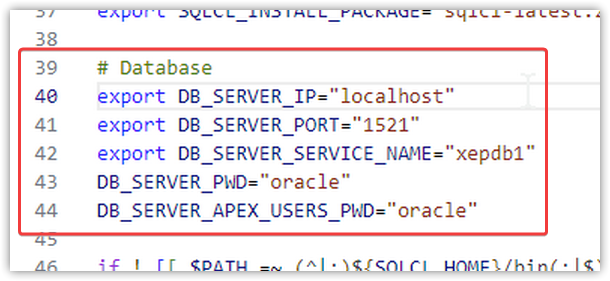

# Roteiro para instalação do Oracle APEX 23.1 e ORDS 23.3 no Linux
Este roteiro descreve os passos necessários para instalar o [**Oracle Application Express (APEX)**](https://apex.oracle.com/pt-br/) versão **23.1** e o [**Oracle REST Data Services (ORDS)**](https://www.oracle.com/br/database/technologies/appdev/rest.html) versão **23.3** em um banco de dados [Oracle 19c ou superior](https://www.oracle.com/br/database/).

***Referências***: <br/>
**APEX**: [APEX Installation Guide](https://docs.oracle.com/en/database/oracle/apex/23.1/htmig/installing-and-configuring-apex-and-ords.html#GUID-8EE981AD-B1F9-46C2-BB5A-C9FE60CCD4AA)<br/>
**ORDS**: [ORDS Installation and Configuration Guide](https://docs.oracle.com/en/database/oracle/oracle-rest-data-services/23.3/ordig/installing-and-configuring-oracle-rest-data-services.html#GUID-B6661F35-3EE3-4CB3-9379-40D0B8E24635)


<h2><u>A T E N Ç Ã O</u>: ESTE ROTEIRO DEVE SER UTILIZADO APENAS EM AMBIENTES LOCAIS DE TESTES E DESENVOLVIMENTO <u>E NÃO DEVE E NÃO PODE, DE NENHUMA FORMA, SER UTILIZADO EM AMBIENTES OFICIAIS DE PRODUÇÃO, MUITO MENOS EM AMBIENTES EXPOSTOS PUBLICAMENTE NA INTERNET</u>.</h2>

<br/>

### 1) Pré-requisitos de software
- **Sistema Operacional**: Qualquer distribuição do **GNU/Linux** (Debian, Ubuntu, Fedora, CentOS, Suse, Arch, etc)
- **Ferramentas de linha de comando**: **`git`**, **`curl`**, **`tar`**, **`gzip`** e **`unzip`**
- **Banco de Dados Oracle 19c ou superior** (ver tópico 2 a seguir)

### 2) Banco de Dados Oracle de testes para validação deste roteiro
Caso seja necessário instalar e executar um banco de dados Oracle de testes, para fazer a validação dos procedimentos deste roteiro, pode-se executar o comando abaixo em um computador com sistema operacional Linux e com o Docker instalado. Isso irá inicializar uma instância do banco de dados Oracle XE 21c com as seguintes características:<br/>
- Porta do Listener: **1521**
- Service Name: **`XEPDB1`**
- Senha dos usuários **`SYS`** e **`SYSTEM`**: **oracle**
```bash
docker run --name oracle-21-full -d -p 1521:1521  \
            -e ORACLE_PASSWORD="oracle"           \
            -e TZ="America/Belem"                 \
            -v oracle-21-full:/opt/oracle/oradata \
       gvenzl/oracle-xe:21-full                && \
docker logs -f oracle-21-full
```
Para mais informações sobre a imagem do banco de dados Oracle referenciada acima, favor acessar a página do seu autor no GitHub: [**https://github.com/gvenzl/oci-oracle-xe**](https://github.com/gvenzl/oci-oracle-xe) 

### 3) Clonar este repositório no computador local
Executar o comando abaixo para clonar este repositório para o sistema de arquivos do computador local:
```bash
git clone https://github.com/dmitsuo/tutorial-instalacao-oracle-apex-ords.git
cd tutorial-instalacao-oracle-apex-ords
```
**A T E N Ç Ã O**: Todos os próximos passos abaixo deste roteiro consideram que o diretório corrente é o do repositório que foi clonado para o computador local, com o nome de **`tutorial-instalacao-oracle-apex-ords`**, conforme comando acima.


### 4) Adicionar permissão de execução aos arquivos de shell script
Executar o comando **`chmod`** abaixo para adicionar permissão de execução aos arquivos de shell script deste repositório:
```bash
chmod +x *.sh
```

### 5) Download de ferramentas auxiliares (Java e SQLcl)
Executar o comando abaixo para fazer o download e descompactar os pacotes de instalação do Java 11 e da ferramenta Oracle SQLcl no diretório corrente<br/>
A ferramenta SQLcl é a sucessora do SQL*Plus e será utilizada para execução de scripts SQL no banco de dados.<br/>O runtime do Java 11 é pré-requisito tanto para o SQLcl quanto para o ORDS.

```bash
./05-download-java-sqlcl.sh
```

### 6) APEX: Download do pacote de instalação do APEX
Executar o comando abaixo para fazer o download e descompactar o pacote de instalação do Oracle APEX 23.1 no diretório corrente e, na sequência, será movido o diretório de imagens do APEX para um local que será acessado pelo ORDS posteriormente, indicado pela variável de ambiente **`APEX_IMAGES`**<br/>
```bash
./10-apex-download.sh
```

### 7) APEX: Ajustar os parâmetros de conexão com o banco de dados
Editar o arquivo [**`00-set-apex-ords-env.sh`**](00-set-apex-ords-env.sh) e alterar os parâmetros relacionados à conexão com o banco de dados, conforme a necessidade. Esses parâmetros estão localizados entre as linhas 39 e 44 desse arquivo e estão identificados com o prefixo **`DB_*`**, conforme indicado abaixo<br/>


### 8) APEX: Instalação do APEX
Executar o comando abaixo para fazer a instalação do APEX 23.1 no banco de dados.
```bash
./15-apex-install.sh
```
O shell script acima, por meio da ferramenta de linha de comando SQLcl, se conecta na instância do banco de dados indicada pelas variáveis de ambiente **`DB_SERVER_IP`**, **`DB_SERVER_PORT`** e **`DB_SERVER_SERVICE_NAME`**, declaradas no arquivo [**`00-set-apex-ords-env.sh`**](00-set-apex-ords-env.sh), e executa as seguintes tarefas de forma automatizada:
- Executa o script SQL principal de instalação do APEX, fazendo a chamada para o arquivo **`apexins.sql`**
- Executa o script SQL de configuração dos serviços RESTful do APEX, fazendo a chamada para o arquivo **`apex_rest_config_core.sql`**
- Desbloqueia e redefine a senha dos usuários de banco de dados relacionados ao APEX 23.1: **`APEX_230100`**, **`FLOWS_FILES`**, **`APEX_PUBLIC_USER`**, **`APEX_REST_PUBLIC_USER`** e **`APEX_LISTENER`**. A senha desses usuários é definida a partir da variável de ambiente **`DB_SERVER_APEX_USERS_PWD`**, declarada no arquivo [**`00-set-apex-ords-env.sh`**](00-set-apex-ords-env.sh)
- Cria uma ACL de rede para o usuário de banco de dados do APEX 23.1, para possibilitar que as aplicações em APEX possam se conectar com sites externos
- Cria o usuário ADMIN da interface de administração do APEX, vinculado à Workspace INTERNAL, e define a sua senha a partir da variável de ambiente **`APEX_ADMIN_PWD`** declarada no arquivo [**`00-set-apex-ords-env.sh`**](00-set-apex-ords-env.sh)
- Executa o script SQL de instalação do idioma Português do Brasil (pt-br) no ambiente de desenvolvimento do APEX, fazendo a chamada para o arquivo **`builder/pt-br/load_pt-br.sql`**, localizado no diretório do pacote de instalação do APEX

### 9) ORDS: Download do pacote de instalação do ORDS
Executar o comando abaixo para fazer o download e descompactar o pacote de instalação do ORDS 23.3 no diretório corrente<br/>
```bash
./20-ords-download.sh
```

### 10) ORDS: Copiar o caminho absoluto para o diretório de imagens do APEX
Antes de fazer a instalação e configuração do ORDS (próximos passos abaixo), deve-se copiar o caminho completo para o diretório de imagens do APEX, que é mantido na variável de ambiente **`APEX_IMAGES`**, isso porque essa informação será solicitada durante a configuração do ORDS para a sua execução em modo *standalone*.<br/>
Para isso, deve-se executar o comando abaixo para imprimir no console o valor dessa variável e depois copiá-lo
```bash
./25-ords-show-apex-images-fullpath.sh
```

### 11) ORDS: Instalação do ORDS
Executar o comando abaixo para instalar o ORDS 23.3 no banco de dados.<br/>
Durante a execução do comando abaixo, quando for solicitado para configurar e inicializar o ORDS em modo *standalone*, deve-se responder positivamente, para que a configuração do ORDS seja feita de forma completa, mesmo que a intenção não seja utilizá-lo dessa forma posteriormente, conforme exemplo mais abaixo
```bash
./30-ords-install.sh
```

Segue abaixo um exemplo completo de respostas informadas no comando acima
```bash

ORDS: Versão 23.3 Produção em seg out 30 15:05:57 2023

Copyright (c) 2010, 2023, Oracle.

Configuração:
  /home/user1/projetos/tutorial-instalacao-oracle-apex-ords/ords-config/

A pasta de configuração /home/user1/projetos/tutorial-instalacao-oracle-apex-ords/ords-config não contém nenhum arquivo de configuração.

Oracle REST Data Services - Instalação Interativa

  Digite um número para selecionar o tipo de instalação
    [1] Instale ou faça upgrade do ORDS apenas no banco de dados
    [2] Crie ou atualize um pool de bancos de dados e instale/ou faça upgrade do ORDS no banco de dados
    [3] Crie ou atualize apenas um pool de banco de dados
  Choose [2]: 2
  Digite um número para selecionar o tipo de conexão do banco de dados a ser usado
    [1] Básico (nome do host, porta, nome do serviço)
    [2] TNS (alias, diretório do TNS)
    [3] URL do banco de dados personalizado
  Choose [1]: 1
  Informe o nome do host do banco de dados [localhost]: localhost
  Informe a porta de listener do banco de dados [1521]: 1521
  Informe o nome do serviço do banco de dados [orcl]: xepdb1
  Forneça um nome de usuário do banco de dados com privilégios de administrador.
    Informe o nome do usuário administrador: sys as sysdba
  Informe a senha do banco de dados para sys as sysdba: ***
Conectando ao usuário do banco de dados: sys as sysdba url: jdbc:oracle:thin:@//localhost:1521/xepdb1

Recuperando informações.
  Digite a senha do banco de dados para ORDS_PUBLIC_USER:
Confirmar senha:
Conectando ao usuário do banco de dados: ORDS_PUBLIC_USER url: jdbc:oracle:thin:@//localhost:1521/xepdb1
  Informe um número para selecionar funcionalidades adicionais para ativação:
    [1] Ações de Banco de Dados (Ativa todas as funcionalidades)
    [2] SQL Ativada REST e API do Banco de Dados
    [3] SQL Ativada para REST
    [4] API do Banco de Dados
    [5] Nenhum
  Choose [1]: 1
  Digite um número para configurar e iniciar o ORDS no modo stand-alone
    [1] Configure e inicie o ORDS no modo stand-alone
    [2] Ignorar
  Choose [1]: 1
  Digite um número para selecionar o protocolo
    [1] HTTP
    [2] HTTPS
  Choose [1]: 1
  Informe a porta HTTP [8080]: 8080
  Informe a localização de recursos estáticos do APEX: /home/user1/projetos/tutorial-instalacao-oracle-apex-ords/apex-images
A definição chamada: db.connectionType foi feita com o valor: basic na configuração: default
A definição chamada: db.hostname foi feita com o valor: localhost na configuração: default
A definição chamada: db.port foi feita com o valor: 1521 na configuração: default
A definição chamada: db.servicename foi feita com o valor: xepdb1 na configuração: default
A definição chamada: plsql.gateway.mode foi feita com o valor: proxied na configuração: default
A definição chamada: db.username foi feita com o valor: ORDS_PUBLIC_USER na configuração: default
A definição chamada: db.password foi feita com o valor: ****** na configuração: default
A definição chamada: feature.sdw foi feita com o valor: true na configuração: default
A definição global chamada: database.api.enabled foi configurada como: true
A definição chamada: restEnabledSql.active foi feita com o valor: true na configuração: default
A definição chamada: security.requestValidationFunction foi feita com o valor: ords_util.authorize_plsql_gateway na configuração: default
A definição global chamada: standalone.http.port foi configurada como: 8080
A definição global chamada: standalone.static.path foi configurada como: /home/user1/projetos/tutorial-instalacao-oracle-apex-ords/apex-images/
A definição global chamada: standalone.static.context.path foi configurada como: /i
A definição global chamada: standalone.context.path foi configurada como: /ords
A definição global chamada: standalone.doc.root foi configurada como: /home/user1/projetos/tutorial-instalacao-oracle-apex-ords/ords-config/global/doc_root
2023-10-30T15:07:17.693Z INFO        Atualização da senha do banco de dados ORDS_PUBLIC_USER em XEPDB1
2023-10-30T15:07:20.996Z INFO        Concluída a atualização da senha do banco de dados de ORDS_PUBLIC_USER. Tempo decorrido: 00:00:03.165

2023-10-30T15:07:20.997Z INFO        Arquivo de log gravado em /home/user1/projetos/tutorial-instalacao-oracle-apex-ords/ords-logs/ords_none_2023-10-30_150717_45564.log
2023-10-30T15:07:21.334Z INFO        HTTP and HTTP/2 cleartext listening on host: 0.0.0.0 port: 8080
2023-10-30T15:07:21.370Z INFO        Disabling document root because the specified folder does not exist: /home/user1/projetos/tutorial-instalacao-oracle-apex-ords/ords-config/global/doc_root
2023-10-30T15:07:21.371Z INFO        Default forwarding from / to contextRoot configured.
2023-10-30T15:07:27.408Z INFO        Configuration properties for: |default|lo|
db.servicename=xepdb1
standalone.context.path=/ords
db.hostname=localhost
db.password=******
conf.use.wallet=true
security.requestValidationFunction=ords_util.authorize_plsql_gateway
standalone.static.context.path=/i
database.api.enabled=true
db.username=ORDS_PUBLIC_USER
standalone.http.port=8080
standalone.static.path=/home/user1/projetos/tutorial-instalacao-oracle-apex-ords/apex-images/
restEnabledSql.active=true
resource.templates.enabled=false
plsql.gateway.mode=proxied
db.port=1521
feature.sdw=true
config.required=true
db.connectionType=basic
standalone.doc.root=/home/user1/projetos/tutorial-instalacao-oracle-apex-ords/ords-config/global/doc_root

2023-10-30T15:07:27.409Z WARNING     *** jdbc.MaxLimit na configuração |default|lo| está usando um valor de 20; esta definição não pode ser dimensionada adequadamente para um ambiente de produção ***
2023-10-30T15:07:27.410Z WARNING     *** jdbc.InitialLimit na configuração |default|lo| está usando um valor de 3; esta definição não pode ser dimensionada adequadamente para um ambiente de produção ***
2023-10-30T15:07:35.470Z INFO

Mapped local pools from /home/user1/projetos/tutorial-instalacao-oracle-apex-ords/ords-config/databases:
  /ords/                              => default                        => VALID


2023-10-30T15:07:35.642Z INFO        Oracle REST Data Services initialized
Oracle REST Data Services version : 23.3.0.r2891830
Oracle REST Data Services server info: jetty/10.0.17
Oracle REST Data Services java info: OpenJDK 64-Bit Server VM 11.0.21+9
```

### 12) ORDS: Ajuste dos parâmetros do pool de conexões do ORDS
Executar o comando abaixo para ajustar os parâmetros do pool de conexões do ORDS
```bash
./35-ords-connection-pool-tuning.sh
```

### 13) ORDS: Desabilitação da nova landing page do ORDS v23+
Executar o comando abaixo para **desabilitar** a nova ***landing page*** introduzida pelo ORDS versão 23 e posteriores, visto que ela tem um bug conhecido que impede o acesso à interface de administração do APEX
```bash
./40-ords-disable-landing-page.sh
```

### 14) ORDS: Execução do ORDS em modo standalone com servidor Jetty embutido
Caso se decida pela execução do ORDS em modo *standalone*, com a execução do servidor de aplicação *Jetty* embutido que acompanha o seu pacote, pode-se executar o comando abaixo
```bash
./45-ords-standalone-start.sh
```

### 15) ORDS: Execução do ORDS em formato de container do Docker com servidor Tomcat
Caso se decida pela execução do ORDS em formato de container do Docker, pode-se executar o comando abaixo.<br/>
É necessário que o Docker tenha sido previamente instalado antes de executar o comando abaixo.
```bash
./50-ords-docker-container-start.sh
```

### 16) Teste de acesso ao ORDS e ambiente de desenvolvimento do APEX
Acessar a URL **`http://nome-ou-ip-do-computador:porta/ords`** para veriricar a correta execução dos passos acima, como por exemplo [**`http://localhost:8080/ords`**](http://localhost:8080/ords)<br/>
Uma tela semelhante à imagem abaixo deve ser exibida. A senha a ser utilizada na tela abaixo foi definida na variável de ambiente **`APEX_ADMIN_PWD`**, declarada no arquivo [**`00-set-apex-ords-env.sh`**](00-set-apex-ords-env.sh).<br/>


